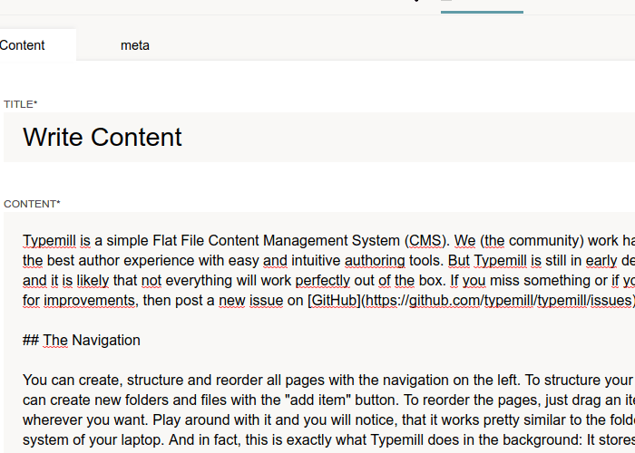

# About typemill-thesaurus

The `thesaurus` is a plugin for searching for synonyms and the meaning of a word for [Typemill](https://github.com/typemill/typemill)

## Features

This plugin works:
* in the admin environment
* in raw editor mode
* with available languages : English, Italian

## Requirements

* A working installation of TYPEMILL downloadable from [Typemill](https://typemill.net/).

## How to install

* Download the [Typemill CMS](https://typemill.net/)

* Download this plugin (zip).

* Unzip the plugin.

* Upload the plugin to the plugin-folder of your Typemill installation.

* Login to your Typemill installation.

* Go to settings -> plugins and activate your plugin.

## Documentation

To display the window containing the suggested synonyms, select a word by double clicking or by selecting while holding down the left mouse button.

After selecting a word, which can also be part of a longer word or several consecutive words, press the right mouse button (contextmenu).

If the word, or a string of words, is present in the dictionary, a list is provided where each row can have one or more children.

The window disappears when the left mouse button is pressed, if the button is pressed over a child row the word or string below replaces the searched word. The change made enables the save button.

## TO DO

Creation of dictionaries for each language already available in the TYPEMILL CMS. In alphabetical order:

* Dutch, Flemish

* French

* German

* Russian 

If other languages were added, currently not available, they would be taken into consideration their dictionaries.

## Licence and Credits

Typemill-thesaurus is published under MIT licence. Please check the licence of the included libraries, too.

This plugin would not have been possible without the [LibreOffice dictionaries](https://github.com/LibreOffice/dictionaries). Make sure you give that project a star on GitHub. Please read the licenses for each individual dictionary in the `data` folder.

Typemill-thesaurus uses the [Toastify](https://github.com/apvarun/toastify-js) library.

## How to Contribute

Here are some contribution-ideas for non-coder:

* Find bugs and errors (open a new issue on github for it).

Some ideas for devs (please fork this repository make your changes and create a pull request):

* Fix a bug.
* Create new thesaurus in other languages.

For hints, questions, problems and support, please open up a new issue on GitHub.

## Support

This is an open source project. You can support this project with a donation.

Donate: https://paypal.me/diamante71